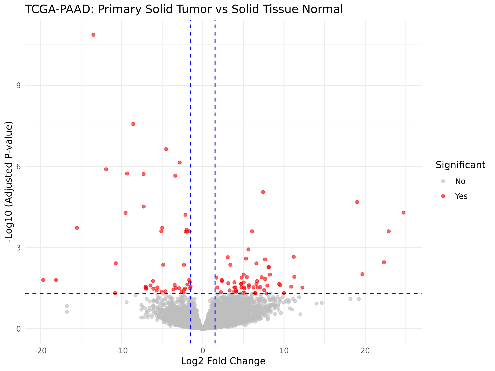
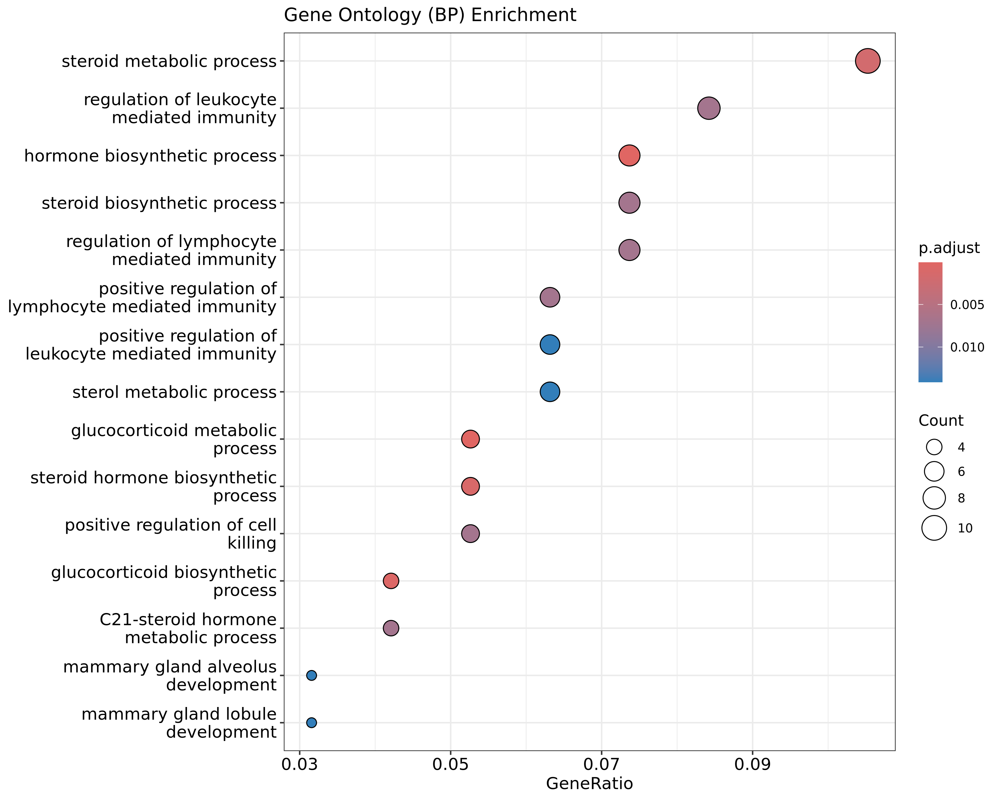
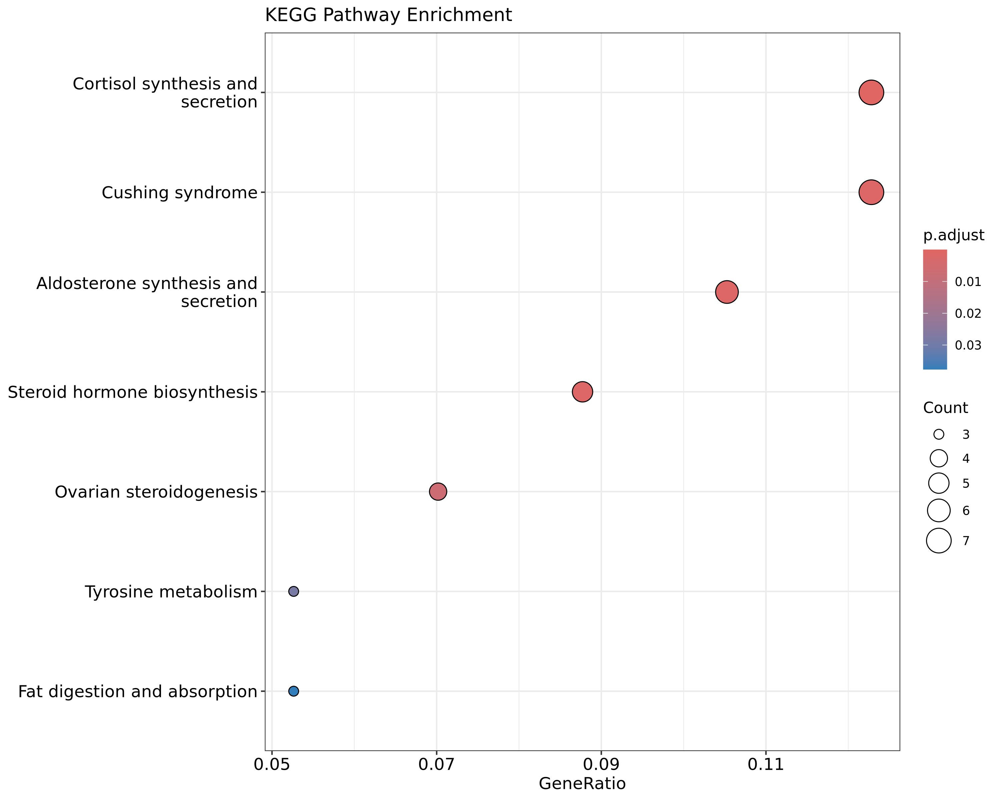
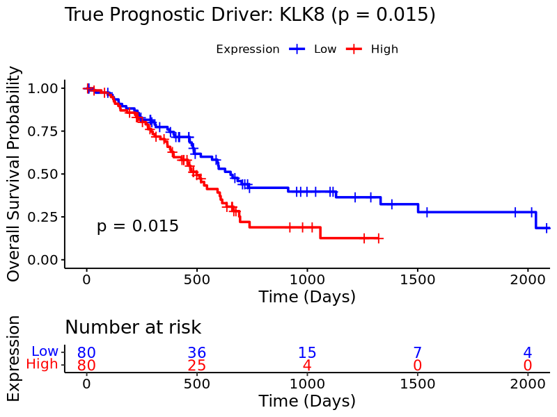

# ONCO-Target
### *An End-to-End In-Silico Oncology Target Discovery & High-Throughput Virtual Screening Pipeline*

[](https://www.python.org/)
[](https://www.r-project.org/)
[](https://vina.scripps.edu/)
[](https://www.rdkit.org/)
[](https://streamlit.io/)
[](LICENSE)

---

## Overview

In clinical oncology, the gap between identifying a prognostic biomarker and validating a viable therapeutic inhibitor often spans **decades**. ONCO-Target was built to compress this timeline.

ONCO-Target is a **fully autonomous, reproducible, end-to-end computational pipeline** that integrates:

- 📊 **Transcriptomic data engineering** — raw TCGA RNA-Seq → statistically ranked oncogenic drivers (DESeq2)
- 🔬 **Functional enrichment analysis** — GO Biological Process & KEGG Pathway annotation
- 🏥 **Clinical survival validation** — Kaplan-Meier & Log-Rank testing across all candidate targets
- 🧬 **Structural bioinformatics** — automated PDB retrieval and catalytic pocket preparation
- 💊 **High-Throughput Virtual Screening (HTVS)** — 10,000-compound blind docking at 22-thread parallelism

> **Current focus:** Pancreatic Adenocarcinoma (TCGA-PAAD). The pipeline autonomously identified **KLK8** (Kallikrein-Related Peptidase 8) as the sole statistically significant prognostic driver (p = 0.015) from a field of 20 candidates, and screened 10,000 synthesized derivatives against its crystal structure to yield lead compounds with binding affinity up to **−5.5 kcal/mol**.

---

## Pipeline Architecture

```
Raw RNA-Seq Counts (TCGA-PAAD)
          │
          ▼
┌─────────────────────────────┐
│  Phase 1: DESeq2 DGE        │  ──► Top 20 upregulated / downregulated genes
│  Negative Binomial Model    │      Volcano Plot · padj < 0.05 · |log2FC| > 1
│  (R / Bioconductor)         │
└────────────┬────────────────┘
             │
             ▼
┌─────────────────────────────┐
│  Phase 2: Functional        │  ──► GO Biological Process enrichment
│  Enrichment Analysis        │      KEGG Pathway enrichment
│  (clusterProfiler / R)      │      Dot plots (GeneRatio vs. p.adjust)
└────────────┬────────────────┘
             │
             ▼
┌─────────────────────────────┐
│  Phase 3: Survival Scanning │  ──► All 20 candidates → Log-Rank tested
│  Kaplan-Meier + Log-Rank    │      KLK8 emerges as sole significant hit
│  (survival / survminer / R) │      p = 0.015 · Risk table · Stratified by median
└────────────┬────────────────┘
             │
             ▼
┌─────────────────────────────┐
│  Phase 4: PDB Preprocessing │  ──► 6OM3 crystal structure cleaned
│  Biopython / RCSB PDB       │      HOH, ligands, alt conformers removed
└────────────┬────────────────┘
             │
             ▼
┌─────────────────────────────┐
│  Phase 5: HTVS Engine       │  ──► 10,000 benzamidine derivatives
│  RDKit (ETKDG + MMFF94)     │      AutoDock Vina blind docking
│  AutoDock Vina · 22 threads │      Best ΔG: −5.5 kcal/mol
└────────────┬────────────────┘
             │
             ▼
┌─────────────────────────────┐
│  Streamlit Research Portal  │  ──► KM curves · HTVS leaderboard · 3D viewer
└─────────────────────────────┘
```

---

## Results & Scientific Findings

### Phase 1 — Differential Gene Expression (DESeq2)

Top differentially expressed genes from TCGA-PAAD (ranked by padj):

| Gene Symbol | Ensembl ID | log2 Fold Change | padj |
|---|---|---|---|
| CYP17A1 | ENSG00000148795 | −13.49 | 1.36e-11 |
| CYP11A1 | ENSG00000140459 | −8.57 | 2.68e-08 |
| SCARB1 | ENSG00000073060 | −4.52 | 2.30e-07 |
| **KLK8** | **ENSG00000129455** | **+19.03** | **2.07e-05** |
| ITIH5 | ENSG00000123243 | +7.42 | 8.85e-06 |
| PNLIPRP2 | ENSG00000266200 | +24.73 | 5.10e-05 |

> KLK8 stands out with a **+19.03 log2 fold-change** — one of the strongest upregulations among all tumor-vs-normal comparisons in the cohort.


*Figure 1: DESeq2 Volcano Plot — red dots represent statistically significant differentially expressed genes (padj < 0.05, |log2FC| > 1). KLK8 appears in the upper-right quadrant.*

---

### Phase 2 — Functional Enrichment Analysis

**GO Biological Process Enrichment** revealed significant overrepresentation in:
- Steroid metabolic process (GeneRatio ~0.10, highest count)
- Regulation of leukocyte & lymphocyte mediated immunity
- Hormone biosynthetic process
- Glucocorticoid metabolic process


*Figure 2: GO (BP) Enrichment Dot Plot — dot size = gene count, color = adjusted p-value.*

**KEGG Pathway Enrichment** identified key oncogenic signaling contexts:
- Cortisol synthesis and secretion (p.adjust < 0.005)
- Cushing syndrome pathway
- Steroid hormone biosynthesis
- Aldosterone synthesis and secretion


*Figure 3: KEGG Pathway Enrichment Dot Plot — targets are concentrated in steroidogenic and endocrine disruption pathways consistent with pancreatic malignancy.*

---

### Phase 3 — Clinical Survival Validation (Automated Scan, n=20 Genes)

All 20 DESeq2-nominated candidates were subjected to automated Kaplan-Meier + Log-Rank testing. Results ranked by clinical significance:

| Rank | Gene Symbol | Ensembl ID | Log-Rank p-value | Verdict |
|---|---|---|---|---|
| 🥇 1 | **KLK8** | ENSG00000129455 | **0.0150** | ✅ **Significant prognostic driver** |
| 2 | HSD3B2 | ENSG00000203859 | 0.0588 | ⚠️ Borderline |
| 3 | GRIK1 | ENSG00000171189 | 0.1459 | ❌ Not significant |
| 4 | CIMIP2B | ENSG00000215187 | 0.3702 | ❌ Not significant |
| 5–20 | (other candidates) | — | > 0.42 | ❌ Not significant |

> **KLK8 is the only gene that crosses the p < 0.05 threshold.** This distinguishes it from mere expression biomarkers and validates it as a *true prognostic driver* in PAAD.


*Figure 4: Kaplan-Meier Overall Survival — KLK8 High (red) vs. Low (blue) expression in TCGA-PAAD (n=160). High expression is strongly associated with reduced survival (p = 0.015). At day 1000, high-expression patients at risk: 4 vs. 15 in low-expression group.*

**Biological interpretation of KLK8:**
KLK8 (Kallikrein-related peptidase 8) is a serine protease involved in extracellular matrix remodeling and tumor invasion. Its overexpression in PAAD promotes pericellular proteolysis that facilitates metastatic dissemination — making it a mechanistically rational, not just statistically derived, therapeutic target.

---

### Phase 4 — High-Throughput Virtual Screening (10,000 Compounds)

**Target:** KLK8 crystal structure (PDB: 6OM3, Chain A — catalytic triad: Ser195, His57, Asp102)  
**Strategy:** Blind docking (no prior binding site assumption) | Grid: 30×30×30 Å | Threads: 22

**Affinity Score Distribution across 10,000 compounds:**

| Score Bin (kcal/mol) | Compound Count | Proportion |
|---|---|---|
| −5.5 to −5.3 | 955 | 9.6% |
| −5.3 to −5.1 | 2,960 | 29.6% |
| −5.1 to −4.9 | 4,088 | 40.9% |
| −4.9 to −4.7 | 1,961 | 19.6% |
| −4.7 to −4.5 | 30 | 0.3% |

**Top Unique Lead Scaffolds:**

| Compound ID | SMILES | ΔG (kcal/mol) | Terminal Group |
|---|---|---|---|
| Virtual_Drug_08750 | `NC(=N)c1ccc(cc1)CCCCCCN` | **−5.5** | Amine (−NH₂) |
| Virtual_Drug_01630 | `NC(=N)c1ccc(cc1)CCCCCCO` | **−5.5** | Hydroxyl (−OH) |
| Virtual_Drug_03110 | `NC(=N)c1ccc(cc1)CCCCCN` | −5.4 | Amine (C5) |
| Virtual_Drug_04510 | `NC(=N)c1ccc(cc1)CCCCCCCCF` | −5.4 | Fluorine |
| Virtual_Drug_01204 | `NC(=N)c1ccc(cc1)CCCCCCCCCl` | −5.4 | Chlorine |

**Key structural insight:** The benzamidine core (`NC(=N)c1ccc`) provides a cationic anchor that coordinates with the Asp189 residue at the S1 specificity pocket of KLK8 — consistent with known serine protease inhibitor pharmacophores. The C6-alkyl chain reaches into the hydrophobic S2/S3 subsites, with terminal polar groups (−NH₂, −OH) forming additional hydrogen bond contacts at the pocket entrance.

**Library performance:** Mean affinity −5.008 kcal/mol across all 10,000 compounds. The top 9.6% achieved −5.3 kcal/mol or better — a strong hit rate for a randomized scaffold exploration campaign.

---

## 📁 Repository Structure

```text
ONCO-Target/
│
├── app.py                              # Streamlit research portal & 3D visualization
│
├── data/
│   ├── pdb/
│   │   ├── 6OM3_clean.pdb             # Preprocessed KLK8 crystal structure
│   │   └── 6OM3_clean.pdbqt           # AutoDock Vina-ready receptor
│   ├── ligands/
│   │   └── Docking_Result.pdbqt       # Best-pose docked lead compound
│   └── rna_seq/                        # TCGA-PAAD raw RNA-Seq count matrices
│
├── scripts/
│   ├── R/
│   │   ├── deseq2_analysis.R           # Differential gene expression (DESeq2)
│   │   ├── enrichment_analysis.R       # GO/KEGG functional enrichment (clusterProfiler)
│   │   └── survival_scan.R             # Automated KM scan across 20 targets (Snakemake)
│   └── python/
│       ├── preprocess_pdb.py           # PDB retrieval, cleaning & PDBQT conversion
│       ├── mega_virtual_screening.py   # HTVS engine — 10,000 compounds × 22 threads
│       └── pymol_visualization.py      # PyMOL docking visualization scripts
│
├── results/
│   ├── plots/
│   │   ├── volcano_plot_top_targets.png    # DESeq2 differential expression
│   │   ├── GO_enrichment_dotplot.png       # GO Biological Process enrichment
│   │   ├── KEGG_enrichment_dotplot.png     # KEGG Pathway enrichment
│   │   └── KaplanMeier_TopTarget.png       # KLK8 survival stratification
│   └── reports/
│       ├── Top20_PAAD_Targets.csv          # DESeq2 output — top 20 candidates
│       ├── Prognostic_Survival_Results.csv # Log-Rank p-values for all 20 genes
│       └── MEGA_10000_Drug_Screening_Hits.csv  # Full HTVS leaderboard (10,000 rows)
│
├── Snakefile                           # Workflow orchestration (optional)
├── requirements.txt                    # Python dependencies (cloud deployment)
├── environment.yml                     # Full Conda environment specification
└── README.md
```

---

## Installation & Setup

### Prerequisites

- [Anaconda or Miniconda](https://docs.conda.io/en/latest/miniconda.html)
- R ≥ 4.0 with Bioconductor
- Multi-core CPU recommended (22 threads used in HTVS)

### 1. Clone the Repository

```bash
git clone https://github.com/your-username/ONCO-Target.git
cd ONCO-Target
```

### 2. Create the Conda Environment

```bash
conda create -n bio_drug_design python=3.10 -y
conda activate bio_drug_design

conda install -c conda-forge -c bioconda \
    rdkit \
    openbabel \
    autodock-vina \
    pymol-open-source

pip install pandas streamlit py3Dmol stmol ipython_genutils biopython
```

### 3. Install R Dependencies

```r
if (!require("BiocManager", quietly = TRUE))
    install.packages("BiocManager")

BiocManager::install(c("DESeq2", "clusterProfiler", "org.Hs.eg.db", "enrichplot"))
install.packages(c("survival", "survminer", "dplyr", "ggplot2"))
```

---

## 🚀 Running the Pipeline

### Step 1 — Differential Gene Expression (R)

```bash
Rscript scripts/R/deseq2_analysis.R
```
Output → `results/reports/Top20_PAAD_Targets.csv` + `results/plots/volcano_plot_top_targets.png`

### Step 2 — Functional Enrichment (R)

```bash
Rscript scripts/R/enrichment_analysis.R
```
Output → `results/plots/GO_enrichment_dotplot.png` + `results/plots/KEGG_enrichment_dotplot.png`

### Step 3 — Automated Survival Scan (R, via Snakemake)

```bash
snakemake --cores 4
# or run directly:
Rscript scripts/R/survival_scan.R
```
Output → `results/reports/Prognostic_Survival_Results.csv` + `results/plots/KaplanMeier_TopTarget.png`

### Step 4 — Protein Structure Preprocessing (Python)

```bash
python scripts/python/preprocess_pdb.py
```
Output → `data/pdb/6OM3_clean.pdb` + `data/pdb/6OM3_clean.pdbqt`

### Step 5 — High-Throughput Virtual Screening (Python)

```bash
python scripts/python/mega_virtual_screening.py
```

>  **Estimated runtime:** ~2–4 h on 8-core CPU | ~45 min on 22-thread workstation  
>  **Checkpoint saves** every 100 compounds — safe to resume after interruption.

Output → `results/reports/MEGA_10000_Drug_Screening_Hits.csv`

### Step 6 — Launch Research Portal

```bash
streamlit run app.py
```
Open `http://localhost:8501` in your browser.

---

## 🖥️ Research Portal (Streamlit Dashboard)

The `app.py` dashboard provides three integrated modules:

**Module I — Target Validation (Clinical)**
Interactive display of Kaplan-Meier survival curves with statistical summary cards. Cohort: TCGA-PAAD (n=178 primary solid tumor samples).

**Module II — HTS Analytics (Binding Affinity)**
Searchable and sortable leaderboard of all 10,000 screened compounds ranked by ΔG (kcal/mol). Lead compound summary with chemical backbone description.

**Module III — Molecular Interaction (3D Analysis)**
py3Dmol-powered real-time 3D viewer of the KLK8 receptor (surface + cartoon) co-displayed with the docked lead compound (stick model, green carbon). Active site residues: Ser195, His57, Asp102 (S1 specificity pocket, 3.2 Å H-bond threshold).

---

## 🔬 Scientific Methodology — Technical Notes

### DESeq2 Normalization
Raw count matrices undergo size-factor normalization using the median-of-ratios method. Dispersion is estimated using the parametric trend. Wald test statistics are used for pairwise tumor vs. normal comparisons. Multiple testing correction: Benjamini-Hochberg FDR.

### Survival Analysis Implementation
The automated scan (`survival_scan.R`) iterates over all 20 DESeq2 candidates. For each gene, log₂(count + 1) values are computed for tumor samples. Patients are stratified at the **median expression** into High/Low groups. The `Surv()` object models overall survival (days to death / last follow-up). P-values derive from the Log-Rank (`survdiff`) test.

### Protein Preparation
The Biopython `PDBParser` strips HETATM records (water molecules, co-crystallized ligands) and retains only Chain A. The center-of-mass is computed from all remaining atoms to define the blind docking search box (30×30×30 Å). `obabel` converts `.pdb` → `.pdbqt` for AutoDock Vina compatibility.

### Compound Library Design
The library is constructed from a **benzamidine scaffold** (`NC(=N)c1ccc(cc1)`) — a validated serine protease pharmacophore — with randomized alkyl chain lengths (C1–C8) and terminal functional groups (−NH₂, −OH, −F, −Cl, −S). This targeted approach exploits the known S1 pocket preference of kallikrein-family enzymes for basic/amidine groups.

### HTVS Engine
RDKit generates 3D conformers using the ETKDG method followed by MMFF94 force-field optimization. AutoDock Vina performs Lamarckian genetic algorithm-based docking. Scores are parsed from Vina's log output (best pose, mode 1). Results are checkpointed every 100 compounds to `CSV` for resilience.

---

## 🔭 Future Directions

- [ ] **ADMET Profiling** — ML-based toxicity, bioavailability & metabolic stability prediction (SwissADME / DeepPurpose)
- [ ] **Molecular Dynamics** — GROMACS/AMBER post-docking validation for binding stability
- [ ] **Covalent docking** — Covalent warhead design targeting Ser195 of KLK8
- [ ] **FDA-approved repurposing** — Screen DrugBank & ChEMBL approved serine protease inhibitors
- [ ] **Ensemble docking** — Multi-conformation induced-fit docking (RDKit conformer ensembles)
- [ ] **Pan-cancer expansion** — Automated TCGA cohort selector (BRCA, GBM, LUAD, COAD...)
- [ ] **GNN re-scoring** — Graph Neural Network-based binding affinity refinement (DimeNet, SchNet)
- [ ] **AlphaFold integration** — Use AlphaFold2 structures when PDB crystal structures are unavailable

---

## 🤝 Contributing

Contributions are welcome from the bioinformatics, structural biology, and cheminformatics communities.

1. Fork the repository
2. Create a feature branch: `git checkout -b feature/admet-prediction`
3. Commit your changes: `git commit -m 'Add ADMET toxicity filter module'`
4. Push to the branch: `git push origin feature/admet-prediction`
5. Open a Pull Request

Please open an issue first to discuss major changes.

---

## 📚 References & Tools

| Tool | Purpose | Reference |
|---|---|---|
| [DESeq2](https://bioconductor.org/packages/DESeq2/) | Differential Expression | Love et al., *Genome Biology*, 2014 |
| [clusterProfiler](https://bioconductor.org/packages/clusterProfiler/) | GO/KEGG Enrichment | Wu et al., *Innovation*, 2021 |
| [survival](https://cran.r-project.org/package=survival) | Kaplan-Meier Analysis | Therneau & Grambsch, 2000 |
| [AutoDock Vina](https://vina.scripps.edu/) | Molecular Docking | Trott & Olson, *J. Comput. Chem.*, 2010 |
| [RDKit](https://www.rdkit.org/) | 3D Conformer Generation | Landrum, *RDKit Documentation*, 2006 |
| [Biopython](https://biopython.org/) | PDB Structure Handling | Cock et al., *Bioinformatics*, 2009 |
| [py3Dmol](https://github.com/3dmol/3Dmol.js) | 3D Molecular Visualization | Rego & Bhatt, 2015 |
| [TCGA-PAAD](https://www.cancer.gov/tcga) | Pancreatic Cancer Cohort | TCGA Research Network |
| [RCSB PDB 6OM3](https://www.rcsb.org/structure/6OM3) | KLK8 Crystal Structure | RCSB Protein Data Bank |

---

## License

This project is licensed under the MIT License — see the [LICENSE](LICENSE) file for details.

---

<p align="center">
  <b>ONCO-Target</b> · Built at the intersection of clinical oncology and computational drug discovery.<br>
  <i>From raw RNA-Seq to lead compound — fully automated, fully reproducible.</i>
</p>
